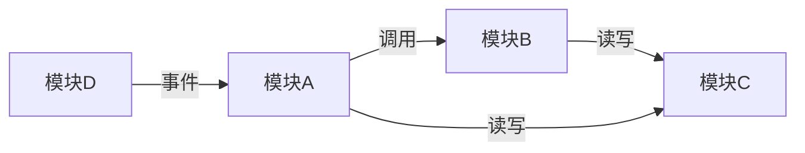
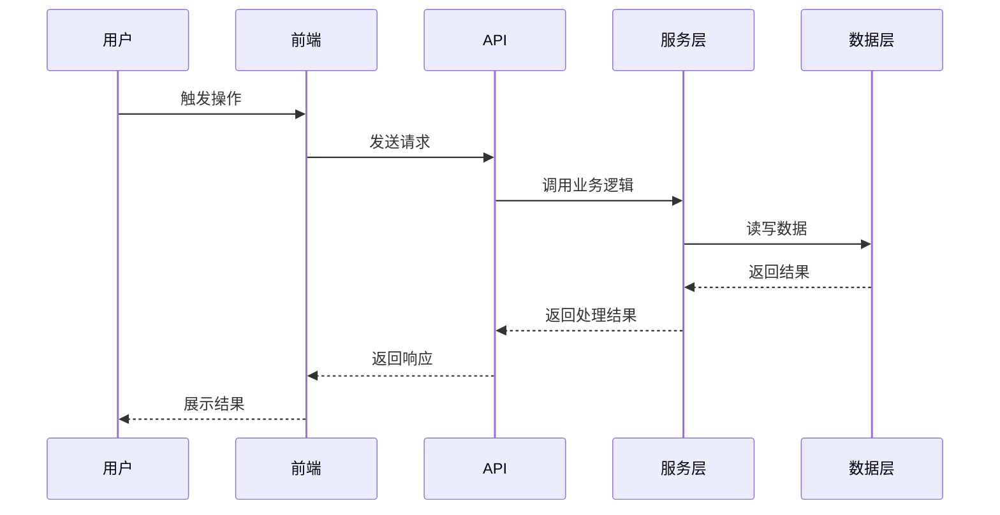
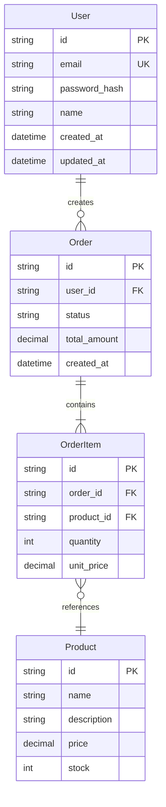

# 技术架构文档

> **项目名称：** [填写项目名称]
> **文档版本：** v1.0
> **创建时间：** [YYYY-MM-DD]
> **最后更新：** [YYYY-MM-DD]
> **关联 PRD：** [PRD 文档路径或标识]
> **编写者：** AI（[模型名称]）
> **评审状态：** [ ] 待评审 / [ ] 评审中 / [ ] 已通过 / [ ] 需修改

---

## 1. 系统架构图

### 1.1 系统分层架构

使用 Mermaid 或 ASCII 图描述系统的整体分层结构。

```mermaid
graph TB
    subgraph "表现层 (Presentation)"
        A[前端应用]
    end

    subgraph "接口层 (API Gateway)"
        B[API 路由]
        C[认证中间件]
        D[日志中间件]
    end

    subgraph "业务层 (Business Logic)"
        E[模块A服务]
        F[模块B服务]
        G[模块C服务]
    end

    subgraph "数据层 (Data Access)"
        H[数据访问层]
        I[缓存层]
    end

    subgraph "基础设施层 (Infrastructure)"
        J[数据库]
        K[文件存储]
        L[外部服务]
    end

    A --> B
    B --> C --> D
    D --> E
    D --> F
    D --> G
    E --> H
    F --> H
    G --> H
    H --> I
    H --> J
    H --> K
    E --> L
    F --> L
```



### 1.2 模块关系图

描述各模块之间的依赖关系和数据流向。



### 1.3 核心数据流向

描述核心业务场景下的数据流转路径。



### 1.4 部署架构（如需要）

描述系统的部署拓扑，包括服务器、容器、负载均衡等。

```
[用户浏览器] → [CDN] → [负载均衡器] → [应用服务器 x N] → [数据库主从]
                                          ↓
                                     [缓存服务器]
                                          ↓
                                     [对象存储]
```

---

## 2. 技术选型

### 2.1 前端技术栈

| 类别 | 选型方案 | 版本 | 选择理由 |
|------|---------|------|---------|
| 框架 | [如 React/Vue/Svelte] | [版本号] | [基于需求特征的选择理由] |
| 语言 | [如 TypeScript/JavaScript] | [版本号] | [选择理由] |
| 状态管理 | [如 Redux/Zustand/Pinia] | [版本号] | [选择理由] |
| UI 组件库 | [如 Ant Design/Element Plus] | [版本号] | [选择理由] |
| 构建工具 | [如 Vite/Webpack] | [版本号] | [选择理由] |
| 包管理器 | [如 pnpm/npm/yarn] | [版本号] | [选择理由] |
| CSS 方案 | [如 Tailwind/CSS Modules] | [版本号] | [选择理由] |
| 测试框架 | [如 Vitest/Jest + Testing Library] | [版本号] | [选择理由] |

### 2.2 后端技术栈

| 类别 | 选型方案 | 版本 | 选择理由 |
|------|---------|------|---------|
| 语言/运行时 | [如 Node.js/Python/Go/Java] | [版本号] | [选择理由] |
| Web 框架 | [如 Express/NestJS/FastAPI] | [版本号] | [选择理由] |
| ORM | [如 Prisma/TypeORM/SQLAlchemy] | [版本号] | [选择理由] |
| 认证方案 | [如 JWT/Session/OAuth] | [版本号] | [选择理由] |
| API 文档 | [如 Swagger/OpenAPI] | [版本号] | [选择理由] |
| 日志方案 | [如 Winston/Pino] | [版本号] | [选择理由] |
| 测试框架 | [如 Jest/Pytest] | [版本号] | [选择理由] |

### 2.3 数据库与存储

| 类别 | 选型方案 | 版本 | 选择理由 |
|------|---------|------|---------|
| 主数据库 | [如 PostgreSQL/MySQL/MongoDB] | [版本号] | [选择理由] |
| 缓存 | [如 Redis/Memcached] | [版本号] | [选择理由] |
| 搜索引擎 | [如 Elasticsearch/MeiliSearch] | [版本号] | [选择理由] |
| 文件存储 | [如 S3/MinIO/本地存储] | [版本号] | [选择理由] |
| 消息队列 | [如 RabbitMQ/Redis Streams] | [版本号] | [选择理由] |

### 2.4 部署与运维

| 类别 | 选型方案 | 版本 | 选择理由 |
|------|---------|------|---------|
| 容器化 | [如 Docker] | [版本号] | [选择理由] |
| 编排 | [如 Docker Compose/K8s] | [版本号] | [选择理由] |
| CI/CD | [如 GitHub Actions/GitLab CI] | [版本号] | [选择理由] |
| 监控 | [如 Prometheus + Grafana] | [版本号] | [选择理由] |
| 日志收集 | [如 ELK/Loki] | [版本号] | [选择理由] |

### 2.5 技术选型对比记录

对关键技术决策，记录候选方案对比过程：

**决策点 1：[决策名称]**

| 评估维度 | 方案 A：[名称] | 方案 B：[名称] | 方案 C：[名称] |
|---------|---------------|---------------|---------------|
| 功能匹配度 | [评分/说明] | [评分/说明] | [评分/说明] |
| 性能表现 | [评分/说明] | [评分/说明] | [评分/说明] |
| 学习曲线 | [评分/说明] | [评分/说明] | [评分/说明] |
| 生态成熟度 | [评分/说明] | [评分/说明] | [评分/说明] |
| 可维护性 | [评分/说明] | [评分/说明] | [评分/说明] |
| 使用者熟悉度 | [评分/说明] | [评分/说明] | [评分/说明] |

**最终选择：** [方案名称]
**选择理由：** [详细说明]

---

## 3. 模块划分

### 3.1 模块总览

| 模块编号 | 模块名称 | 职责描述 | 对应 PRD 需求 |
|---------|---------|---------|-------------|
| M-01 | [名称] | [一句话描述职责] | [需求标识列表] |
| M-02 | [名称] | [一句话描述职责] | [需求标识列表] |
| M-03 | [名称] | [一句话描述职责] | [需求标识列表] |

### 3.2 模块详细设计

#### 模块 M-01：[模块名称]

| 属性 | 描述 |
|------|------|
| **职责** | [详细描述该模块负责的功能范围] |
| **对应需求** | [PRD 中的需求标识，如 REQ-001, REQ-002] |
| **公开接口** | [该模块对外暴露的接口列表] |
| **依赖模块** | [该模块依赖的其他模块] |
| **被依赖方** | [依赖该模块的其他模块] |
| **目录结构** | [该模块在代码库中的目录位置] |

**公开接口列表：**

| 接口名称 | 方法 | 描述 | 输入 | 输出 |
|---------|------|------|------|------|
| [接口名] | [GET/POST/...] | [接口描述] | [输入参数] | [返回数据] |

**内部设计说明：**

- [关键设计决策说明]
- [核心算法或业务逻辑描述]
- [错误处理策略]

#### 模块 M-02：[模块名称]

（格式同上）

#### 模块 M-03：[模块名称]

（格式同上）

### 3.3 模块依赖关系矩阵

```
         M-01  M-02  M-03  M-04
M-01      -     →     →     -
M-02      -      -     -     →
M-03      -      -     -     -
M-04      -      -     -     -

→ 表示行模块依赖列模块
```

---

## 4. 数据模型

### 4.1 核心实体关系图（ER 图）



### 4.2 实体详细定义

#### 实体：[实体名称]

| 字段名 | 类型 | 约束 | 默认值 | 描述 |
|--------|------|------|--------|------|
| id | [UUID/INTEGER] | PK, AUTO | - | 主键 |
| [字段名] | [类型] | [NOT NULL/UNIQUE/INDEX] | [默认值] | [描述] |
| [字段名] | [类型] | [FK → 表.字段] | - | [描述] |
| created_at | TIMESTAMP | NOT NULL | CURRENT_TIMESTAMP | 创建时间 |
| updated_at | TIMESTAMP | NOT NULL | CURRENT_TIMESTAMP | 更新时间 |

**索引设计：**

| 索引名 | 字段 | 类型 | 用途 |
|--------|------|------|------|
| [索引名] | [字段列表] | [UNIQUE/NORMAL] | [查询场景说明] |

**数据校验规则：**

| 字段 | 校验规则 | 错误提示 |
|------|---------|---------|
| [字段名] | [如：长度 1-100，不允许特殊字符] | [错误提示信息] |

#### 实体：[实体名称]

（格式同上）

### 4.3 枚举类型定义

| 枚举名称 | 值 | 描述 |
|---------|-----|------|
| [枚举名] | [值1] | [描述] |
| [枚举名] | [值2] | [描述] |
| [枚举名] | [值3] | [描述] |

### 4.4 存储方案

| 数据类型 | 存储方案 | 理由 |
|---------|---------|------|
| 结构化业务数据 | [如 PostgreSQL] | [选择理由] |
| 会话/缓存数据 | [如 Redis] | [选择理由] |
| 文件/媒体资源 | [如 S3/本地] | [选择理由] |
| 搜索索引 | [如 Elasticsearch] | [选择理由] |
| 日志数据 | [如 日志文件/Loki] | [选择理由] |

### 4.5 数据迁移策略

- [ ] 是否需要数据迁移：[是/否]
- [ ] 迁移工具：[如 Flyway/Prisma Migrate/自定义脚本]
- [ ] 迁移策略：[如：每次 schema 变更生成迁移脚本，支持回滚]
- [ ] 种子数据：[是否需要初始数据，如何加载]

---

## 5. 接口定义

### 5.1 API 总览

| 模块 | 接口数量 | 基础路径 |
|------|---------|---------|
| [模块名] | [数量] | [/api/v1/xxx] |
| [模块名] | [数量] | [/api/v1/xxx] |

### 5.2 接口详细定义

#### 模块：[模块名称]

**接口 1：[接口名称]**

| 属性 | 值 |
|------|-----|
| **路径** | [如 POST /api/v1/users] |
| **描述** | [接口功能描述] |
| **认证** | [如：需要 JWT Token / 不需要认证] |
| **权限** | [如：仅管理员 / 所有已登录用户] |
| **对应需求** | [PRD 需求标识] |

**请求参数：**

| 参数名 | 位置 | 类型 | 必填 | 约束 | 描述 |
|--------|------|------|------|------|------|
| [参数名] | [body/query/path] | [类型] | [是/否] | [约束条件] | [描述] |

**请求示例：**

```json
{
  "email": "user@example.com",
  "password": "SecurePass123!"
}
```

**成功响应（200/201）：**

```json
{
  "code": 0,
  "message": "success",
  "data": {
    "id": "uuid-xxx",
    "email": "user@example.com",
    "name": "示例用户",
    "created_at": "2025-01-01T00:00:00Z"
  }
}
```

**错误响应：**

| HTTP 状态码 | 错误码 | 描述 | 场景 |
|------------|--------|------|------|
| 400 | [如 INVALID_PARAMS] | 参数校验失败 | [触发条件] |
| 401 | UNAUTHORIZED | 未认证 | [触发条件] |
| 403 | FORBIDDEN | 无权限 | [触发条件] |
| 404 | NOT_FOUND | 资源不存在 | [触发条件] |
| 409 | [如 EMAIL_EXISTS] | 邮箱已存在 | [触发条件] |
| 500 | INTERNAL_ERROR | 服务器内部错误 | [触发条件] |

**接口 2：[接口名称]**

（格式同上）

### 5.3 通用响应格式

**成功响应：**

```json
{
  "code": 0,
  "message": "success",
  "data": { }
}
```

**错误响应：**

```json
{
  "code": "[错误码]",
  "message": "[错误描述]",
  "details": [ ]
}
```

### 5.4 全局错误码表

| 错误码 | HTTP 状态码 | 描述 |
|--------|------------|------|
| 0 | 200 | 成功 |
| INVALID_PARAMS | 400 | 参数校验失败 |
| UNAUTHORIZED | 401 | 未认证 |
| FORBIDDEN | 403 | 无权限 |
| NOT_FOUND | 404 | 资源不存在 |
| INTERNAL_ERROR | 500 | 服务器内部错误 |

---

## 6. 非功能性设计

### 6.1 安全设计

| 安全维度 | 方案 | 实现细节 |
|---------|------|---------|
| 认证 | [如 JWT] | [Token 生成、刷新、过期策略] |
| 授权 | [如 RBAC] | [角色定义、权限矩阵] |
| 密码存储 | [如 bcrypt] | [加密算法、盐值策略] |
| 输入校验 | [如 Joi/Zod] | [校验层级：前端/后端/数据库] |
| SQL 注入防护 | [如 参数化查询/ORM] | [具体防护措施] |
| XSS 防护 | [如 转义/CSP] | [具体防护措施] |
| CSRF 防护 | [如 Token/SameSite] | [具体防护措施] |
| 速率限制 | [如 express-rate-limit] | [限制规则] |
| HTTPS | [如 Let's Encrypt/Nginx] | [证书管理策略] |
| 敏感数据 | [如 环境变量/加密存储] | [密钥管理策略] |

### 6.2 性能设计

| 性能维度 | 目标 | 方案 |
|---------|------|------|
| 响应时间 | [如 < 200ms (P95)] | [优化策略：缓存、索引、异步处理] |
| 吞吐量 | [如 1000 QPS] | [优化策略：连接池、负载均衡] |
| 并发处理 | [如 支持 100 并发] | [优化策略：异步队列、连接复用] |
| 数据库优化 | [如 查询 < 50ms] | [索引策略、查询优化、读写分离] |
| 前端性能 | [如 FCP < 1.5s] | [代码分割、懒加载、CDN] |
| 缓存策略 | [如 Redis 缓存热点数据] | [缓存键设计、过期策略、缓存穿透防护] |

### 6.3 可用性设计

| 可用性维度 | 目标 | 方案 |
|-----------|------|------|
| 可用性 | [如 99.9%] | [高可用方案：冗余、故障转移] |
| 容错 | [如 优雅降级] | [熔断、限流、降级策略] |
| 数据备份 | [如 每日备份] | [备份策略、恢复流程] |
| 监控告警 | [如 实时监控] | [监控指标、告警规则、通知渠道] |
| 日志管理 | [如 结构化日志] | [日志级别、日志收集、日志保留策略] |
| 健康检查 | [如 /health 端点] | [检查项、检查频率] |

### 6.4 可扩展性设计

| 扩展维度 | 方案 |
|---------|------|
| 水平扩展 | [如无状态设计、会话外置] |
| 垂直扩展 | [如资源限制、配置调优] |
| 功能扩展 | [如插件机制、事件驱动] |
| 数据扩展 | [如分库分表策略（预留）] |

---

## 7. 架构决策记录（ADR）

### ADR-001：[决策标题]

| 属性 | 内容 |
|------|------|
| **状态** | [已采纳 / 已废弃 / 已替代] |
| **日期** | [YYYY-MM-DD] |
| **决策者** | [AI / 使用者] |
| **关联需求** | [PRD 需求标识] |

**背景（Context）：**
[描述触发此决策的背景和上下文。为什么需要做这个决策？面临什么问题或约束？]

**候选方案（Options）：**

| 方案 | 描述 | 优势 | 劣势 |
|------|------|------|------|
| 方案 A | [描述] | [优势] | [劣势] |
| 方案 B | [描述] | [优势] | [劣势] |

**决策（Decision）：**
[选择了哪个方案，以及选择的具体配置或约束]

**理由（Reasoning）：**
[为什么选择这个方案而非其他方案。基于什么标准做出的判断。]

**影响（Consequences）：**
- **正面影响：** [这个决策带来的好处]
- **负面影响：** [这个决策带来的代价或风险]
- **对其他模块的影响：** [这个决策对系统其他部分的影响]

---

### ADR-002：[决策标题]

（格式同上）

### ADR-003：[决策标题]

（格式同上）

---

## 8. 附录

### 8.1 术语表

| 术语 | 定义 |
|------|------|
| [术语] | [定义] |

### 8.2 参考文档

| 文档 | 路径/链接 |
|------|---------|
| PRD | [路径] |
| 使用者画像 | [路径] |
| 项目画像 | [路径] |

### 8.3 变更历史

| 版本 | 日期 | 变更内容 | 变更原因 |
|------|------|---------|---------|
| v1.0 | [日期] | 初始版本 | - |
| v1.1 | [日期] | [变更描述] | [变更原因] |
